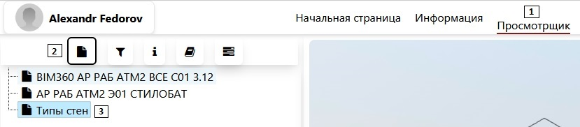

# Правила использования сервиса РСО

_Пожалуйста, старайтесь не делать запросы к разным большим моделям одновременно. Все запросы обрабатываются в последовательном режиме, то есть за раз обрабатывается лишь один запрос. Схема примерно следующая: вы создали запрос -> ревит (скачивает) открывает документ -> запускается подсчет рсо -> возвращается результат. Запросы к уже открытым моделям исполняться быстрее, так как не требуется заново скачивать и открывать модель. Очередь также всегда пытается оптимизировать сама себя, запросы группируются по документам, то есть если запросы имели следующую последовательность: 1ый док, 2ой док, 1ый док, 1ый док -> очередь будет иметь вид 1, 1, 1, 2. Из этого следует, что пользователь может ожидать дольше, но общая работа сервера снизится._

1. Перед запуском необходимо войти в свой bim360 аккаунт (левый верхний угол, кнопка "Войти в BIM360");

2. Для выгрузки РСО через BIM360:
   1. Необходимо зайти на вкладку "Просмотрщик";
   2. Перейти на вкладку "BIM файлы";
   3. Выбрать интересующий объект;
   4. Перейти во вкладку задачи;
   5. Нажать на кнопку "Создать РСО запрос";
   6. Сформированный запрос можно увидеть во вкладке "запросы к ревиту" (см. пункт 3);

3. Выгрузка РСО, используя локальный файлы с сервера в офисе:
   1. Нажать на иконку своего пользователя;
   2. В выпадающем списке выбрать "Запросы к ревиту";
   3. Убедиться что тип запроса "РСО";
   4. Нажать на кнопку "Получить" (запросы к ревиту отобразятся справа);
   5. Нажать на кнопку "Создать новый запрос";
   6. Введить имя запроса (длина имени от 3 до 25 символов, старайтесь не использовать нестандартные комбинации);
   7. Укажите путь до файла на локальном сервере (имя файла должно оканчиваться расширением `.rvt`)
   8. Нажать на кнопку "создать";

4. Запросы имеют вид:
    1. Статус указывает на состояние запроса (исполняется, выполнен, ошибка, отменен);
    2. Используя кнопку "Отменить" можно отменить запрос (запрос отменится только когда до него дойдет очередь на сервере);
    3. Результат можно скачать, используя одноименную кнопку.
    
